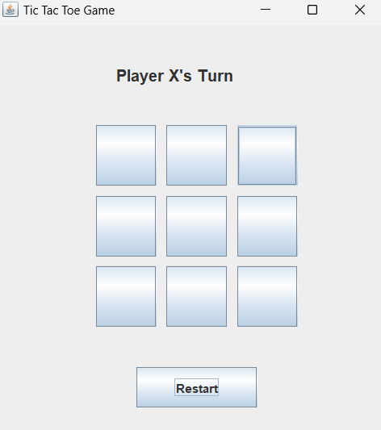

# Tic Tac Toe (Java Swing)

## Project Overview
This is a simple Tic Tac Toe game implemented in Java using Swing for the GUI. It supports two players taking turns and detects wins or draws dynamically.

## How to Run
1. Ensure you have Java JDK installed.
2. Compile the code with: `javac TicTacToe.java`
3. Run the program using: `java TicTacToe`

## Features
- 3x3 grid layout with buttons to place X or O
- Displays whose turn it is
- Detects wins and draws
- Restart game functionality
- Highlights the winning combination

## Known Limitations
- Currently only supports 3x3 grid
- No AI opponent, only 2-player mode

## Future Improvements
- Expand to larger grid sizes (e.g., 4x4)
- Add AI for single-player option
- Improve UI with better layout and styling

## Author
Aman Balsway
